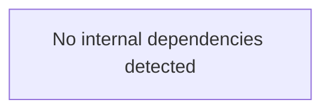

# code2docs — Architecture

> Auto-generated from 28 modules, 153 functions, 30 classes

## Module Dependency Graph

## Architecture Layers

### Other

- `code2docs`
- `code2docs.__main__`
- `code2docs.generators`
- `code2docs.generators.architecture_gen`
- `code2docs.generators.changelog_gen`
- `code2docs.generators.coverage_gen`
- `code2docs.generators.depgraph_gen`
- `code2docs.generators.examples_gen`
- `code2docs.generators.mkdocs_gen`
- `code2docs.generators.module_docs_gen`
- `code2docs.generators.readme_gen`
- `code2docs.sync`
- `code2docs.sync.differ`
- `code2docs.sync.updater`
- `code2docs.sync.watcher`

### Analysis

- `code2docs.analyzers`
- `code2docs.analyzers.dependency_scanner`
- `code2docs.analyzers.docstring_extractor`
- `code2docs.analyzers.endpoint_detector`
- `code2docs.analyzers.project_scanner`

### API / CLI

- `code2docs.cli`
- `code2docs.generators.api_changelog_gen`
- `code2docs.generators.api_reference_gen`

### Config

- `code2docs.config`

### Export / Output

- `code2docs.formatters`
- `code2docs.formatters.badges`
- `code2docs.formatters.markdown`
- `code2docs.formatters.toc`

## Key Classes

```mermaid
classDiagram
    class ModuleDocsGenerator {
        -__init__(self, config, result) None
        +generate_all(self) None
        -_generate_module(self, mod_name, mod_info) None
        -_render_header(self, mod_name, mod_info) None
        -_render_overview(self, mod_info) None
        -_render_classes_section(self, mod_name) None
        -_render_functions_section(self, mod_name) None
        -_render_dependencies_section(self, mod_info) None
        ... +9 more
    }
    class MarkdownFormatter {
        -__init__(self) None
        +heading(self, text, level) None
        +paragraph(self, text) None
        +blockquote(self, text) None
        +code_block(self, code, language) None
        +inline_code(self, text) None
        +bold(self, text) None
        +link(self, text, url) None
        ... +5 more
    }
    class ReadmeGenerator {
        -__init__(self, config, result) None
        +generate(self) None
        -_build_context(self, project_name) None
        -_calc_avg_complexity(self) None
        -_build_module_tree(self) None
        -_build_manual(self, project_name, sections) None
        -_build_overview_section(project_name, context) None
        -_build_install_section(_project_name, context) None
        ... +5 more
    }
    class ExamplesGenerator {
        -__init__(self, config, result) None
        +generate_all(self) None
        -_generate_basic_usage(self) None
        -_generate_import_section(self, project_name, public_classes) None
        -_generate_class_usage_section(self, public_classes) None
        -_generate_function_usage_section(self, public_functions) None
        -_generate_entry_point_examples(self) None
        -_generate_class_examples(self, classes) None
        ... +4 more
    }
    class ApiReferenceGenerator {
        -__init__(self, config, result) None
        +generate_all(self) None
        -_generate_index(self) None
        -_generate_module_api(self, mod_name, mod_info) None
        -_render_api_header(self, mod_name, mod_info) None
        -_render_api_classes(self, mod_name) None
        -_render_api_functions(self, mod_name) None
        -_render_api_imports(self, mod_info) None
        ... +3 more
    }
    class ApiChangelogGenerator {
        -__init__(self, config, result) None
        +generate(self, project_path) None
        +save_snapshot(self, project_path) None
        -_build_snapshot(self) None
        -_load_snapshot(path) None
        -_diff(self, old, new) None
        -_diff_functions(old, new, changes) None
        -_diff_classes(old, new, changes) None
        ... +1 more
    }
    class DepGraphGenerator {
        -__init__(self, config, result) None
        +generate(self) None
        -_collect_edges(self) None
        -_import_matches(imp, module) None
        -_render_mermaid(self, edges) None
        -_render_matrix(self, edges) None
        -_calc_degrees(edges) None
        -_render_degree_table(self, in_deg, out_deg) None
    }
    class Differ {
        -__init__(self, config) None
        +detect_changes(self, project_path) None
        +save_state(self, project_path) None
        -_load_state(self, state_path) None
        -_compute_state(self, project) None
        -_file_to_module(filepath, project) None
    }
    class ChangelogGenerator {
        -__init__(self, config, result) None
        +generate(self, project_path, max_entries) None
        -_get_git_log(self, project_path, max_entries) None
        -_classify_message(self, message) None
        -_group_by_type(self, entries) None
        -_render(self, grouped) None
    }
    class ArchitectureGenerator {
        -__init__(self, config, result) None
        +generate(self) None
        -_generate_module_graph(self) None
        -_generate_class_diagram(self) None
        -_detect_layers(self) None
        -_generate_metrics_table(self) None
    }
    class DependencyScanner {
        +scan(self, project_path) None
        -_parse_pyproject(self, path) None
        -_parse_pyproject_regex(self, path) None
        -_parse_setup_py(self, path) None
        -_parse_requirements_txt(self, path) None
        -_parse_dep_string(dep_str) None
    }
    class DocstringExtractor {
        +extract_all(self, result) None
        +parse(self, docstring) None
        -_extract_summary(lines) None
        -_classify_section(line) None
        -_parse_sections(self, lines, info) None
        +coverage_report(self, result) None
    }
    class CoverageGenerator {
        -__init__(self, config, result) None
        +generate(self) None
        -_render_summary(report) None
        -_render_per_module(self) None
        -_render_undocumented(self) None
    }
    class MkDocsGenerator {
        -__init__(self, config, result) None
        +generate(self, docs_dir) None
        -_build_nav(self, docs_dir) None
        +write(self, output_path, content) None
    }
    class ProjectScanner {
        -__init__(self, config) None
        -_build_llm_config(self) None
        +analyze(self, project_path) None
    }
```

## Detected Patterns

- **recursion_analyze** (recursion) — confidence: 90%, functions: `code2docs.analyzers.project_scanner.ProjectScanner.analyze`
- **state_machine_Differ** (state_machine) — confidence: 70%, functions: `code2docs.sync.differ.Differ.__init__`, `code2docs.sync.differ.Differ.detect_changes`, `code2docs.sync.differ.Differ.save_state`, `code2docs.sync.differ.Differ._load_state`, `code2docs.sync.differ.Differ._compute_state`

## Entry Points

- `code2docs.__getattr__` — Lazy import heavy modules on first access.
- `code2docs.sync.updater.Updater.__init__`
- `code2docs.sync.updater.Updater.apply` — Regenerate documentation for changed modules.
- `code2docs.formatters.markdown.MarkdownFormatter.__init__`
- `code2docs.formatters.markdown.MarkdownFormatter.heading` — Add a heading.
- `code2docs.formatters.markdown.MarkdownFormatter.paragraph` — Add a paragraph.
- `code2docs.formatters.markdown.MarkdownFormatter.blockquote` — Add a blockquote.
- `code2docs.formatters.markdown.MarkdownFormatter.code_block` — Add a fenced code block.
- `code2docs.formatters.markdown.MarkdownFormatter.inline_code` — Return inline code string.
- `code2docs.formatters.markdown.MarkdownFormatter.bold` — Return bold string.
- `code2docs.formatters.markdown.MarkdownFormatter.link` — Return a Markdown link.
- `code2docs.formatters.markdown.MarkdownFormatter.list_item` — Add a list item.
- `code2docs.formatters.markdown.MarkdownFormatter.table` — Add a Markdown table.
- `code2docs.formatters.markdown.MarkdownFormatter.separator` — Add a horizontal rule.
- `code2docs.formatters.markdown.MarkdownFormatter.blank` — Add a blank line.
- `code2docs.formatters.markdown.MarkdownFormatter.render` — Render accumulated Markdown to string.
- `code2docs.formatters.toc.generate_toc` — Generate a table of contents from Markdown headings.
- `code2docs.generators.readme_gen.ReadmeGenerator.__init__`
- `code2docs.generators.readme_gen.ReadmeGenerator.generate` — Generate full README content.
- `code2docs.generators.readme_gen.ReadmeGenerator._build_context` — Build template context from analysis result.
- `code2docs.generators.readme_gen.ReadmeGenerator._calc_avg_complexity` — Calculate average cyclomatic complexity.
- `code2docs.generators.readme_gen.ReadmeGenerator._build_module_tree` — Build text-based module tree.
- `code2docs.generators.readme_gen.ReadmeGenerator._build_manual` — Fallback manual README builder (orchestrator).
- `code2docs.generators.readme_gen.ReadmeGenerator._build_overview_section` — Build overview section with badges and stats.
- `code2docs.generators.readme_gen.ReadmeGenerator._build_install_section` — Build installation section from dependencies.
- `code2docs.generators.readme_gen.ReadmeGenerator._build_quickstart_section` — Build quick start section from entry points.
- `code2docs.generators.readme_gen.ReadmeGenerator._build_api_section` — Build API overview section with classes and functions.
- `code2docs.generators.readme_gen.ReadmeGenerator._build_structure_section` — Build project structure section from module tree.
- `code2docs.generators.readme_gen.ReadmeGenerator._build_endpoints_section` — Build endpoints section from detected routes.
- `code2docs.generators.readme_gen.ReadmeGenerator.write` — Write README, respecting sync markers if existing file has them.
- `code2docs.generators.readme_gen.generate_readme` — Convenience function to generate a README.
- `code2docs.sync.differ.ChangeInfo.__str__`
- `code2docs.sync.differ.Differ.__init__`
- `code2docs.sync.differ.Differ.detect_changes` — Compare current file hashes with saved state. Return list of changes.
- `code2docs.sync.differ.Differ.save_state` — Save current file hashes as state.
- `code2docs.sync.differ.Differ._load_state` — Load previous state from file.
- `code2docs.sync.differ.Differ._compute_state` — Compute file hashes for all Python files in the project.
- `code2docs.sync.differ.Differ._file_to_module` — Convert file path to module name.
- `code2docs.generators.coverage_gen.CoverageGenerator.__init__`
- `code2docs.generators.coverage_gen.CoverageGenerator.generate` — Generate coverage.md content.
- `code2docs.generators.coverage_gen.CoverageGenerator._render_summary` — Render overall coverage summary.
- `code2docs.generators.coverage_gen.CoverageGenerator._render_per_module` — Render per-module coverage table.
- `code2docs.generators.coverage_gen.CoverageGenerator._render_undocumented` — List all undocumented public functions and classes.
- `code2docs.generators.depgraph_gen.DepGraphGenerator.__init__`
- `code2docs.generators.depgraph_gen.DepGraphGenerator.generate` — Generate dependency-graph.md content.
- `code2docs.generators.depgraph_gen.DepGraphGenerator._collect_edges` — Build directed edges from module imports.
- `code2docs.generators.depgraph_gen.DepGraphGenerator._import_matches` — Check if an import string refers to a known module.
- `code2docs.generators.depgraph_gen.DepGraphGenerator._render_mermaid` — Render Mermaid graph from edges.
- `code2docs.generators.depgraph_gen.DepGraphGenerator._render_matrix` — Render a coupling matrix as a Markdown table.
- `code2docs.generators.depgraph_gen.DepGraphGenerator._calc_degrees` — Calculate in-degree and out-degree per module.
- `code2docs.generators.depgraph_gen.DepGraphGenerator._render_degree_table` — Render fan-in/fan-out table.
- `code2docs.generators.generate_docs` — High-level function to generate all documentation.
- `code2docs.generators.module_docs_gen.ModuleDocsGenerator.__init__`
- `code2docs.generators.module_docs_gen.ModuleDocsGenerator.generate_all` — Generate documentation for all modules. Returns {filename: content}.
- `code2docs.generators.module_docs_gen.ModuleDocsGenerator._generate_module` — Generate detailed documentation for a single module (orchestrator).
- `code2docs.generators.module_docs_gen.ModuleDocsGenerator._render_header` — Render module title and source metadata.
- `code2docs.generators.module_docs_gen.ModuleDocsGenerator._render_overview` — Render module overview from docstring.
- `code2docs.generators.module_docs_gen.ModuleDocsGenerator._render_classes_section` — Render classes and their method tables.
- `code2docs.generators.module_docs_gen.ModuleDocsGenerator._render_functions_section` — Render standalone functions with signatures and call info.
- `code2docs.generators.module_docs_gen.ModuleDocsGenerator._render_dependencies_section` — Render imports split into internal and stdlib.
- `code2docs.generators.module_docs_gen.ModuleDocsGenerator._render_metrics_section` — Render metrics summary table.
- `code2docs.generators.module_docs_gen.ModuleDocsGenerator._count_file_lines` — Count lines in source file.
- `code2docs.generators.module_docs_gen.ModuleDocsGenerator._calc_module_avg_cc` — Calculate average cyclomatic complexity for module functions.
- `code2docs.generators.module_docs_gen.ModuleDocsGenerator._get_module_docstring` — Try to extract module-level docstring.
- `code2docs.generators.module_docs_gen.ModuleDocsGenerator._get_module_classes`
- `code2docs.generators.module_docs_gen.ModuleDocsGenerator._get_module_functions`
- `code2docs.generators.module_docs_gen.ModuleDocsGenerator._get_class_methods`
- `code2docs.generators.module_docs_gen.ModuleDocsGenerator._get_module_metrics`
- `code2docs.generators.module_docs_gen.ModuleDocsGenerator.write_all` — Write all generated module docs.
- `code2docs.generators.api_reference_gen.ApiReferenceGenerator.__init__`
- `code2docs.generators.api_reference_gen.ApiReferenceGenerator.generate_all` — Generate API reference for all modules. Returns {filename: content}.
- `code2docs.generators.api_reference_gen.ApiReferenceGenerator._generate_index` — Generate API index page.
- `code2docs.generators.api_reference_gen.ApiReferenceGenerator._generate_module_api` — Generate API reference for a single module (orchestrator).
- `code2docs.generators.api_reference_gen.ApiReferenceGenerator._render_api_header` — Render module header with source info.
- `code2docs.generators.api_reference_gen.ApiReferenceGenerator._render_api_classes` — Render classes with their method signatures.
- `code2docs.generators.api_reference_gen.ApiReferenceGenerator._render_api_functions` — Render standalone functions with signatures and complexity.
- `code2docs.generators.api_reference_gen.ApiReferenceGenerator._render_api_imports` — Render module imports list.
- `code2docs.generators.api_reference_gen.ApiReferenceGenerator._get_class_methods` — Get FunctionInfo objects for class methods.
- `code2docs.generators.api_reference_gen.ApiReferenceGenerator._format_signature` — Format a function signature string.
- `code2docs.generators.api_reference_gen.ApiReferenceGenerator.write_all` — Write all generated API reference files.
- `code2docs.generators.changelog_gen.ChangelogGenerator.__init__`
- `code2docs.generators.changelog_gen.ChangelogGenerator.generate` — Generate changelog content from git log.
- `code2docs.generators.changelog_gen.ChangelogGenerator._get_git_log` — Extract git log entries.
- `code2docs.generators.changelog_gen.ChangelogGenerator._classify_message` — Classify commit message by conventional commit type.
- `code2docs.generators.changelog_gen.ChangelogGenerator._group_by_type` — Group entries by type.
- `code2docs.generators.changelog_gen.ChangelogGenerator._render` — Render grouped changelog to Markdown.
- `code2docs.generators.mkdocs_gen.MkDocsGenerator.__init__`
- `code2docs.generators.mkdocs_gen.MkDocsGenerator.generate` — Generate mkdocs.yml content.
- `code2docs.generators.mkdocs_gen.MkDocsGenerator._build_nav` — Build navigation structure from docs tree and analysis.
- `code2docs.generators.mkdocs_gen.MkDocsGenerator.write` — Write mkdocs.yml file.
- `code2docs.generators.examples_gen.ExamplesGenerator.__init__`
- `code2docs.generators.examples_gen.ExamplesGenerator.generate_all` — Generate all example files. Returns {filename: content}.
- `code2docs.generators.examples_gen.ExamplesGenerator._generate_basic_usage` — Generate basic_usage.py example (orchestrator).
- `code2docs.generators.examples_gen.ExamplesGenerator._generate_import_section` — Generate import statements for the example.
- `code2docs.generators.examples_gen.ExamplesGenerator._generate_class_usage_section` — Generate class instantiation and method call examples.
- `code2docs.generators.examples_gen.ExamplesGenerator._generate_function_usage_section` — Generate standalone function call examples.
- `code2docs.generators.examples_gen.ExamplesGenerator._generate_entry_point_examples` — Generate examples based on entry points.
- `code2docs.generators.examples_gen.ExamplesGenerator._generate_class_examples` — Generate examples for major classes.
- `code2docs.generators.examples_gen.ExamplesGenerator._get_major_classes` — Get classes with most methods (likely most important).
- `code2docs.generators.examples_gen.ExamplesGenerator._get_init_args` — Get __init__ args for a class.
- `code2docs.generators.examples_gen.ExamplesGenerator._get_public_methods` — Get public methods of a class.
- `code2docs.generators.examples_gen.ExamplesGenerator.write_all` — Write all generated example files.
- `code2docs.generators.api_changelog_gen.ApiChangelogGenerator.__init__`
- `code2docs.generators.api_changelog_gen.ApiChangelogGenerator.generate` — Generate api-changelog.md by comparing with previous snapshot.
- `code2docs.generators.api_changelog_gen.ApiChangelogGenerator.save_snapshot` — Save current API state as snapshot for future diffs.
- `code2docs.generators.api_changelog_gen.ApiChangelogGenerator._build_snapshot` — Build a JSON-serializable snapshot of current API.
- `code2docs.generators.api_changelog_gen.ApiChangelogGenerator._load_snapshot` — Load previous snapshot, or None if not found.
- `code2docs.generators.api_changelog_gen.ApiChangelogGenerator._diff` — Compute list of API changes between old and new snapshots.
- `code2docs.generators.api_changelog_gen.ApiChangelogGenerator._diff_functions` — Diff function signatures.
- `code2docs.generators.api_changelog_gen.ApiChangelogGenerator._diff_classes` — Diff class definitions.
- `code2docs.generators.api_changelog_gen.ApiChangelogGenerator._render` — Render changelog as Markdown.
- `code2docs.generators.architecture_gen.ArchitectureGenerator.__init__`
- `code2docs.generators.architecture_gen.ArchitectureGenerator.generate` — Generate architecture documentation.
- `code2docs.generators.architecture_gen.ArchitectureGenerator._generate_module_graph` — Generate Mermaid module dependency graph.
- `code2docs.generators.architecture_gen.ArchitectureGenerator._generate_class_diagram` — Generate Mermaid class diagram for key classes.
- `code2docs.generators.architecture_gen.ArchitectureGenerator._detect_layers` — Detect architectural layers from module names.
- `code2docs.generators.architecture_gen.ArchitectureGenerator._generate_metrics_table` — Generate metrics summary table.
- `code2docs.cli.DefaultGroup.parse_args`
- `code2docs.cli.main` — code2docs — Auto-generate project documentation from source code.
- `code2docs.cli.generate` — Generate documentation (default command).
- `code2docs.cli.sync` — Synchronize documentation with source code changes.
- `code2docs.cli.watch` — Watch for file changes and auto-regenerate docs.
- `code2docs.cli.init` — Initialize code2docs.yaml configuration file.
- `code2docs.config.Code2DocsConfig.from_yaml` — Load configuration from code2docs.yaml.
- `code2docs.config.Code2DocsConfig.to_yaml` — Save configuration to YAML file.
- `code2docs.analyzers.project_scanner.ProjectScanner.__init__`
- `code2docs.analyzers.project_scanner.ProjectScanner._build_llm_config` — Create code2llm Config tuned for documentation generation.
- `code2docs.analyzers.project_scanner.analyze_and_document` — Convenience function: analyze a project in one call.
- `code2docs.analyzers.dependency_scanner.DependencyScanner.scan` — Scan project for dependency information.
- `code2docs.analyzers.dependency_scanner.DependencyScanner._parse_pyproject` — Parse pyproject.toml for dependencies.
- `code2docs.analyzers.dependency_scanner.DependencyScanner._parse_pyproject_regex` — Fallback regex-based pyproject.toml parser.
- `code2docs.analyzers.dependency_scanner.DependencyScanner._parse_setup_py` — Parse setup.py for dependencies (regex-based, no exec).
- `code2docs.analyzers.dependency_scanner.DependencyScanner._parse_requirements_txt` — Parse requirements.txt.
- `code2docs.analyzers.dependency_scanner.DependencyScanner._parse_dep_string` — Parse a dependency string like 'package>=1.0'.
- `code2docs.analyzers.docstring_extractor.DocstringExtractor.extract_all` — Extract docstrings for all functions and classes.
- `code2docs.analyzers.docstring_extractor.DocstringExtractor.parse` — Parse a docstring into structured sections (orchestrator).
- `code2docs.analyzers.docstring_extractor.DocstringExtractor._extract_summary` — Extract the first-line summary.
- `code2docs.analyzers.docstring_extractor.DocstringExtractor._classify_section` — Classify a line as a section header, or return None.
- `code2docs.analyzers.docstring_extractor.DocstringExtractor._parse_sections` — Walk remaining lines, dispatching content to the right section.
- `code2docs.analyzers.docstring_extractor.DocstringExtractor.coverage_report` — Calculate docstring coverage statistics.
- `code2docs.analyzers.endpoint_detector.EndpointDetector.detect` — Detect all endpoints from the analysis result.
- `code2docs.analyzers.endpoint_detector.EndpointDetector._parse_decorator` — Try to parse a route decorator string.
- `code2docs.analyzers.endpoint_detector.EndpointDetector._scan_django_urls` — Scan urls.py files for Django URL patterns.

## Metrics Summary

| Metric | Value |
|--------|-------|
| Modules | 28 |
| Functions | 153 |
| Classes | 30 |
| CFG Nodes | 974 |
| Patterns | 2 |
| Analysis Time | 1.06s |
